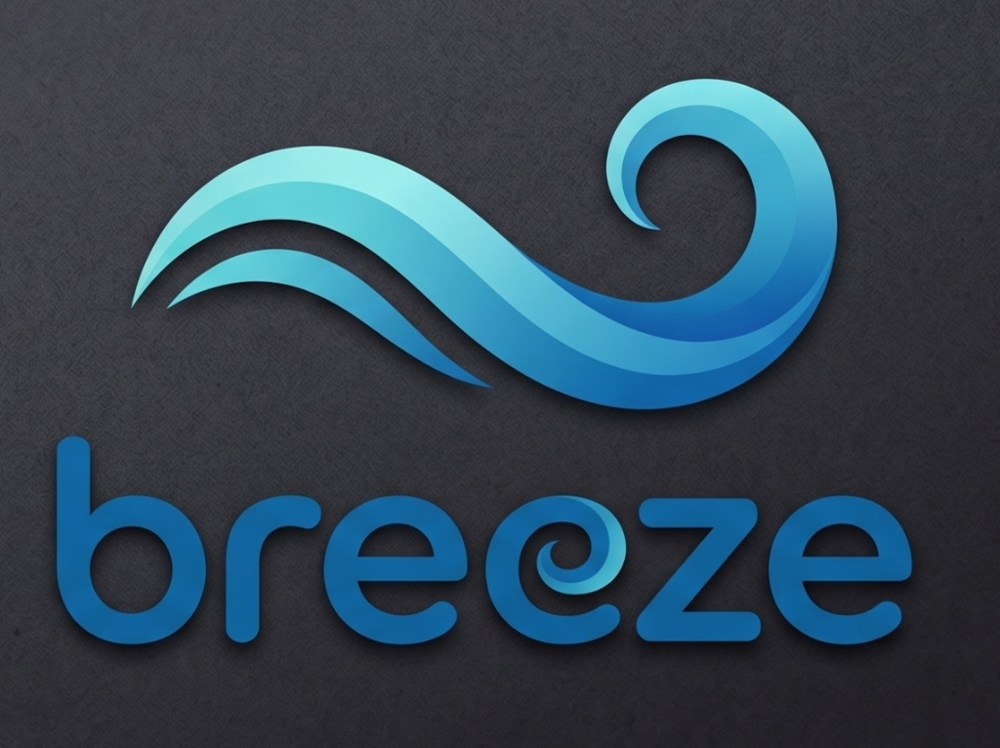

<div align="center">
  
  <h1>Breeze 🌬️</h1>
  <p><strong>An offline-first AI desktop assistant that reads your screen and automates your workflows.</strong></p>
  
  [](https://breeze-desktop.vercel.app/)
  [](LICENSE)
  [](https://microsoft.com)
</div>

<br />

Breeze is a next-generation, AI-powered Windows desktop agent. Running as a sleek, transparent glassmorphic overlay, Breeze is always one click away from helping you navigate software, opening media, and taking autonomous actions on your computer.

---

## ✨ Features

- 🤖 **Agent Mode (Autonomous Action)**: Tell Breeze what you want to achieve, and it takes control. Utilizing advanced screen awareness, it executes precise mouse clicks and keyboard strokes natively on your OS.
- 🎙️ **Voice First**: Built-in Speech-to-Text integration means you can seamlessly talk to Breeze.
- 🗣️ **High-Quality Speech Synthesis**: Breeze talks back using state-of-the-art neural Edge TTS for natural, human-like voice feedback.
- 🎵 **Media Deep Links**: Instantly play music. Ask Breeze to "play lo-fi beats on YouTube" or open a specific song on Spotify, and it handles the routing.
- 💬 **WhatsApp Automation**: Send messages hands-free. Breeze integrates with WhatsApp to open chats and send texts on your behalf.
- 👁️ **Screen Awareness (Local OCR)**: To respect rate limits and maximize privacy, Breeze uses a powerful **Hybrid Map Architecture**. It uses local Tesseract OCR to read your screen text instead of constantly uploading heavy screenshots to cloud vision APIs.
- 🎨 **Premium Glassmorphic UI**: Built with PyQt6, featuring a modern, ChatGPT-style command bar that respects your taskbar geometry and floats cleanly on your desktop.

---

## 🛠️ Architecture & Tech Stack

Breeze relies on a robust combination of local tools and cloud LLMs:
- **PyQt6**: Drives the frameless, transparent overlay and vector-painted UI elements.
- **Tesseract OCR (pytesseract)**: Powers local screen text extraction.
- **Google GenAI API (Gemini)**: Serves as the core logic engine to process intents and generate spatial coordinate commands.
- **PyAutoGUI**: Executes OS-level automation for clicks and keyboard input.
- **Edge-TTS & Pygame**: Delivers high-fidelity neural voice output.
- **SpeechRecognition**: Handles microphone input and transcription.
- **MSS**: Provides lightning-fast screen captures.

---

## 🚀 Installation & Setup

### Prerequisites
1. **Windows 10/11**
2. **Python 3.10+**
3. **Tesseract OCR**: You *must* install Tesseract on your system for the local vision capabilities to work. 
   - [Download Tesseract for Windows](https://github.com/UB-Mannheim/tesseract/wiki)
   - Ensure `tesseract.exe` is added to your system `PATH`.

### Local Setup

1. **Clone the repository:**
   ```bash
   git clone https://github.com/Myself-Praveen/Breeze.git
   cd Breeze
   ```

2. **Install dependencies:**
   ```bash
   pip install -r requirements.txt
   pip install edge-tts pygame pytesseract keyring
   ```

3. **Set your API Key:**
   Breeze uses `keyring` to securely store your Google Gemini API key. When you run the app for the first time, it will prompt you if it cannot find a valid key.

### Run the App
```bash
python main.py
```
Breeze will initialize as a transparent overlay at the bottom of your screen. Click the microphone icon to speak, or simply type your command.

---

## 🧠 Example Commands

- *"Play Interstellar soundtrack on YouTube."*
- *"Text Praveen on WhatsApp saying I'll be 5 minutes late."*
- *"Click on the search bar and type 'weather in New York'."*
- *"Open Spotify."*

---

## 🌐 Website
Breeze features a beautiful landing page deployed on Vercel. 
Check it out here: [https://breeze-desktop.vercel.app/](https://breeze-desktop.vercel.app/)

## 📄 License
This project is open-source and available under the MIT License.
